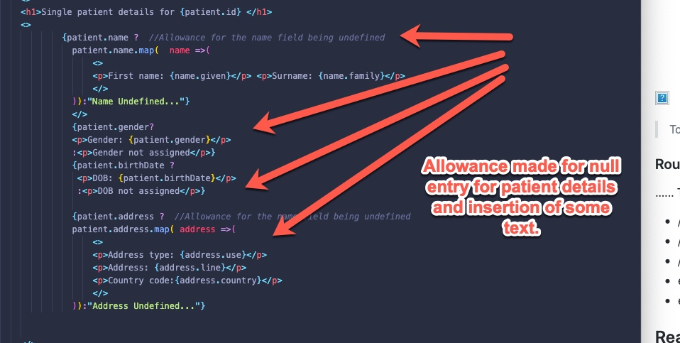
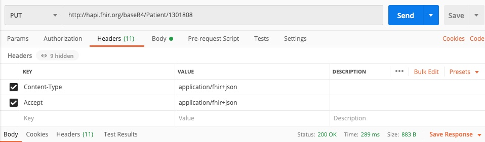
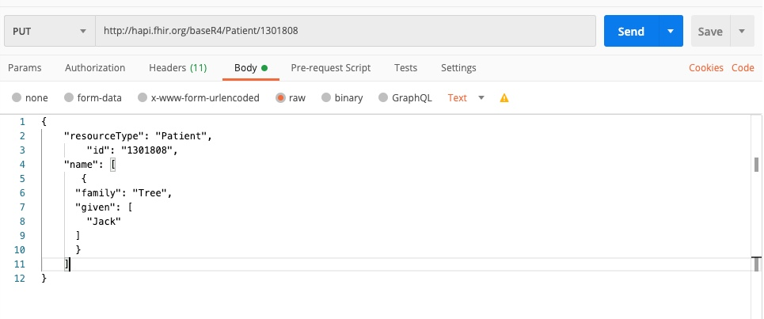
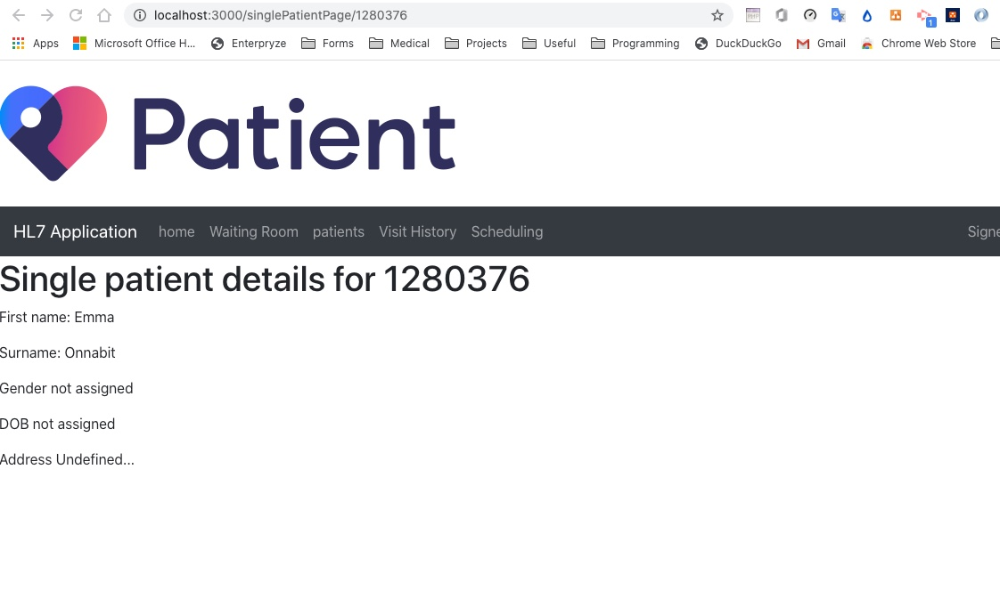

# Project - ReactJS app.

Name: ... Niall Phelan ...

## Overview.
...... This Patient application is a simple application for the listing of patients for appointments, editing, reviewing, scheduling and deleting  .........

............ 
 
 + UI features
   User interation with mednu selection added, with dynamic behaviour using multiple views between home, patient...
 + Home page with details of the app
 + Routing added for multiple views amd 1 parameterised url added for a single patient search
 + Core hooks useState and useEffect used as part of api response from Patients and patient listing
 + 2 web api endpoints used for this application to get a list of patients and get a singular patient

## Setup requirements.

...... run "npm install" in the route directory and then "npm start" which will start the react application in the localhost port 3000 ........

## API Data Model.

1. Patient Listing
.....
+ A patient listing of 10 patients is given from the following GET request:
+ `http://hapi.fhir.org/baseR4/Patient/${match.params.id}`
+ The FHIR test server is located at http://hapi.fhir.org/
........

2. Single patient listing
.....
+ A single patient is retrieved from the following GET request
+ `http://hapi.fhir.org/baseR4/Patient/${match.params.id}` where match.params.id is given from the patient selected on the patient listing page
+ Note: I've allowed for null enteries for patient data such as address, DOB etc

.....

3. Updating a single patient
.....
+ A single patient can be updated using the following PUT request
+ http://hapi.fhir.org/baseR4/Patient/{PatientID}

Image of put request with header types

Image of put request with Body information
...

![][model]

......To be completed.........

## App Design.

### Component catalogue.

....... To be completed .......

![][stories]

### UI Design.

Parameterised URL

![][view]
>To be completed 

### Routing.

...... To be completed ......... 
Route path="/" exact component={HomePage} />
          <Route path="/patients" component={PatientsPage} />
          <Route path="/waitingroom" component={WaitingRoomPage} />
          <Route path="/visithistory" component={VisitHistoryPage} />
          <Route path="/scheduling" component={SchedulingPage}/>
          <Route path="/singlePatientPage/:id" component={SinglePatientPage}/>
+ /patients - displays all list of 10 patients.
+ /waiting room - displays a list of patients in the waiting room
+ /visithistory - display a list of visit history
+ /scheduling - displays a list of schedule visits 
+ /singlePatientPage:id display details for a patient selected from the patient listing with all relevant details added

## React feature set.

..... To be completed  ......

+ useState and useEffect hooks - src/components/fileA.js
+ useContext hook - src/components/fileb.js
+ Extended Link - src/components/fileA.js
+ Programmatic navigation - src/pages/fileC.js
+ etc
+ etc
+ etc

## Independent learning.

. . . . . To be completed  ......... 

[model]: ./data.jpg
[view]: ./view.png
[stories]: ./storybook.png
